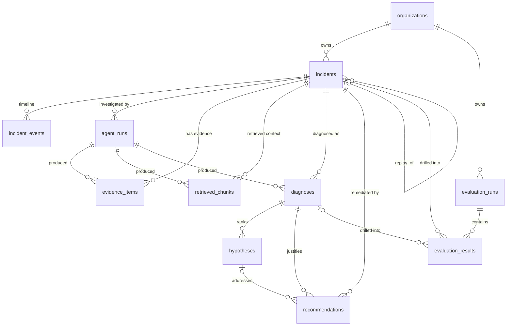

# Data model — incident investigation persistence (KAN-15)

Status: **design** · Target engine: **PostgreSQL 15+** · DDL: [`infra/db/schema.sql`](../infra/db/schema.sql)

## 1. Purpose

The AI SRE Agent currently keeps everything in memory and on the local
filesystem (`backend/telemetry/store.py`, the in-memory `DiagnosisService`
store). This document designs the PostgreSQL model that lets the agent **store a
complete incident investigation** — intake, agent runs, evidence, retrieved
runbook context, diagnosis, ranked hypotheses, remediation recommendations, and
scenario-based evaluation results — so any past investigation can be **replayed
and reviewed**.

The model deliberately mirrors the structures the code already produces, so
persistence is a thin mapping rather than a redesign:

| Existing code | Source | Persisted as |
|---|---|---|
| `NormalizedIncident` | `backend/telemetry/schema.py` | `incidents` (+ `evidence_items` for metrics/logs) |
| `IncidentDiagnosis` | `backend/analysis/models.py` | `diagnoses` |
| `Hypothesis` | `backend/analysis/models.py` | `hypotheses` |
| `Recommendation` / `RemediationPlan` | `backend/remediation/models.py` | `recommendations` |
| `RetrievedChunk` | `backend/rag/models.py` | `retrieved_chunks` |
| Evaluation baseline | `sample-data/evaluation/baseline.json` | `evaluation_runs` + `evaluation_results` |

## 2. Design decisions (resolving the open questions)

**Access layer — SQLAlchemy 2.0 + Alembic.**
Of the three options in the ticket, SQLAlchemy is the pragmatic, portfolio-grade
choice. SQLAlchemy 2.0's typed `Mapped[...]` models read almost like the
existing dataclasses, Alembic gives first-class versioned migrations (important
once data exists), and a raw-SQL escape hatch is always available for the few
analytical queries that want it. SQLModel was set aside as a thinner, younger
layer over SQLAlchemy+Pydantic with tighter version coupling; hand-rolled raw-SQL
repositories were set aside because they reintroduce the migration and
boilerplate problems an ORM already solves. The intended shape is a **repository
per aggregate** (`IncidentRepository`, `AgentRunRepository`, …) over a
SQLAlchemy session, keeping the web/agent layers framework-agnostic exactly as
`DiagnosisService` is today.

**Vector chunks — stored by reference, not embedded (per decision).**
`retrieved_chunks` persists everything needed to *show and audit* a retrieval —
`source`, `heading`, `citation`, the chunk `chunk_text`, and the similarity
`score` — plus a **reference** to the embedding in the external vector store
(`vector_store`, `chunk_external_id`). It intentionally does **not** store the
embedding vector itself yet. When pgvector (or Chroma) is introduced, the
migration is additive: enable the `vector` extension and add an
`embedding vector(N)` column (the line is already stubbed in the DDL). No table
restructuring is required.

**Tenancy — designed for multi-tenant / SaaS from day one (per decision).**
Every tenant-owned table carries a non-null `org_id` referencing an
`organizations` root table, and indexes lead with `org_id`. This costs little
now but avoids a painful retrofit later: tenant isolation can be enforced with
PostgreSQL **row-level security** (a disabled policy template ships at the bottom
of `schema.sql`) by setting `app.current_org` per request. For a single-developer
local run you simply create one organization and use its id everywhere — the
model stays simple to operate while remaining SaaS-ready.

Other conventions: UUID primary keys (`gen_random_uuid()`) so ids are
non-guessable and safe to generate client- or server-side in a distributed
setup; `timestamptz` everywhere; enums expressed as `text` + `CHECK` constraints
(easier to evolve than native PG `ENUM` types) whose allowed values match the
Python enums in the codebase; all objects live in a dedicated `sre` schema.

## 3. Entity relationships



`incidents` is the aggregate root of one investigation. Every artifact the agent
produces hangs off it (directly, or via the `agent_run` that produced it), which
is what makes a full replay a single keyed read.

## 4. Investigation lifecycle

1. **Intake.** An incident is created in `incidents` with
   `intake_source` ∈ {`alert`, `manual`, `replay`}. The normalized context
   (`scenario`, `service`, `environment`, `severity`, alert fields, `symptoms`)
   is written here; the raw payload is stored elsewhere and only **referenced**
   via `raw_payload_ref`. An `intake` row is appended to `incident_events`.
2. **Agent run starts.** A row is inserted into `agent_runs`
   (`status = 'running'`) capturing engine/model/provider/prompt metadata and a
   `correlation_id` that ties to the existing observability logs (KAN-12). A
   `run_started` event is appended.
3. **Evidence + retrieval.** As the pipeline gathers signals it writes
   `evidence_items` (logs, metrics, health checks, connector output) and
   `retrieved_chunks` (runbook hits with citation + external vector reference),
   each linked to the incident and the run.
4. **Diagnosis.** The structured result lands in `diagnoses`
   (one per run; the latest accepted one is flagged `is_current`), and its ranked
   root causes in `hypotheses`.
5. **Recommendations.** Advisory remediation actions are written to
   `recommendations`, linked to the diagnosis and (optionally) the specific
   hypothesis they address. `execution_status` defaults to `manual_only` — a
   placeholder honoring the advisory-only contract.
6. **Run completes.** `agent_runs` is updated with `status`, `latency_ms`,
   token/cost fields, and any redacted error; a `run_completed` event is
   appended.
7. **Review / replay.** Because every artifact is keyed to the incident and
   stamped with `created_at`, the whole investigation can be re-read and
   rendered. Replaying a scenario creates a **new** incident with
   `intake_source = 'replay'` and `replay_of_incident_id` pointing at the
   original, so reruns are comparable without mutating history.

## 5. Where each agent output is persisted

This is the acceptance-criterion mapping — every major output has one clear home.

| Agent output | Table | Key columns |
|---|---|---|
| Normalized incident / intake | `incidents` | `scenario, service, environment, severity, alert_*, symptoms, raw_payload_ref` |
| Lifecycle / audit timeline | `incident_events` | `event_type, payload, actor, occurred_at` |
| Model run + tool calls + cost | `agent_runs` | `engine, model_provider, model_name, prompt_version, tool_calls, latency_ms, *_tokens, error_*` |
| Logs / metrics / health / connector evidence | `evidence_items` | `kind, source, summary, detail, score` |
| Runbook / vector retrievals | `retrieved_chunks` | `source, heading, citation, chunk_text, score, vector_store, chunk_external_id` |
| Diagnosis summary | `diagnoses` | `status, engine, summary, symptoms, reference_citations, is_current` |
| Ranked root-cause hypotheses | `hypotheses` | `rank, cause, confidence, confidence_label, root_cause_category, evidence, missing_information` |
| Remediation recommendations | `recommendations` | `action_category, risk_level, rollback_note, approval_required, production_impacting, execution_status` |
| Evaluation suite run | `evaluation_runs` | `baseline_version, model_*, pass_rate, avg_top_confidence, git_sha` |
| Per-scenario eval outcome | `evaluation_results` | `scenario, expected_*, predicted_*, category_match, cause_match, runbook_match, passed` |

## 6. Table reference

**`organizations`** — tenant root. Everything else cascades from here.

**`incidents`** — one investigation. Holds the normalized context and the inbound
alert (denormalized for fast listing). `external_ref` is the business key
(`NormalizedIncident.id`) and is unique *within a tenant*. `expected_root_cause`
holds evaluation ground truth for replayed sample scenarios. Raw payloads are
referenced (`raw_payload_ref`), never inlined.

**`incident_events`** — append-only timeline used for audit and to reconstruct
*when* each step happened during review. Redacted `payload` jsonb carries
event-specific detail (e.g. old/new status).

**`agent_runs`** — one model execution. Captures provider/model/prompt version,
status, latency, token counts, `cost_usd`, redacted error info, and a
`tool_calls` jsonb array of `{tool, args_redacted, result_ref, latency_ms, ok}`.
`correlation_id` links to existing structured logs.

**`evidence_items`** — discrete facts gathered during the run (a metric anomaly,
a log sample, a health-check result, a connector output). `detail` jsonb holds
the redacted extracted value; `score` is set when the item is ranked.

**`retrieved_chunks`** — RAG retrievals, mirroring `RetrievedChunk`. Stores the
citation and chunk text for display/replay plus a reference into the external
vector store. **No embedding column yet** (vector-by-reference); the pgvector
column is stubbed in the DDL.

**`diagnoses`** — structured diagnosis per run, mirroring `IncidentDiagnosis`.
A partial unique index guarantees at most one `is_current` diagnosis per
incident, so reviews and reruns never produce ambiguity about the live result.

**`hypotheses`** — ranked root causes for a diagnosis, mirroring `Hypothesis`.
`(diagnosis_id, rank)` is unique; `confidence` is constrained to `[0,1]`.
`root_cause_category` aligns with the evaluation baseline's
`expected_category`.

**`recommendations`** — advisory actions, mirroring `Recommendation`. Carries
`risk_level`, `rollback_note`, `approval_required`, `production_impacting`, and
the `execution_status` **placeholder** (default `manual_only`) reserved for a
future execution path. Optionally linked to the `hypothesis_id` it addresses.

**`evaluation_runs` / `evaluation_results`** — scenario regression testing.
A run records the baseline version, model metadata, `git_sha`, and aggregate
pass rate; each result records expected vs. predicted category/cause/runbook and
the boolean matches, optionally linking to the `incident_id`/`diagnosis_id`
produced so a failing case can be opened and replayed.

## 7. Replay & review support

* **Replay** creates a fresh incident (`intake_source = 'replay'`,
  `replay_of_incident_id` → original). History is never overwritten, so a rerun
  after a prompt/model change is directly comparable to the original.
* **Review** of any incident is a keyed read: `incidents` → its `agent_runs` →
  `evidence_items`, `retrieved_chunks`, `diagnoses` (→ `hypotheses`),
  `recommendations`, ordered by `created_at`. `incident_events` supplies the
  chronological narrative.
* **Regression drill-down**: an `evaluation_results` row points back at the
  incident/diagnosis it judged, so a red scenario links straight to the full
  investigation that produced it.

## 8. Secrets & sensitive data — explicitly excluded

Persisted data is treated as potentially shared/exported, so secrets never reach
the database. The policy:

* **Raw payloads are referenced, not stored.** `incidents.raw_payload_ref` is a
  pointer (object-store key or path) to the raw artifact, which lives outside the
  DB and outside version control — consistent with today's `data/raw` store.
* **Never persisted, anywhere:** API keys, tokens, bearer/`Authorization`
  headers, connection strings, passwords, and provider credentials
  (`OPENAI_API_KEY`, `ANTHROPIC_API_KEY`, etc. stay in `.env`, never in a row).
* **Redaction before write.** `tool_calls.args_redacted`,
  `evidence_items.detail`, `incident_events.payload`, and `alert_labels` pass
  through a redaction step (drop/`***`-mask known secret keys and high-entropy
  values) before being written. `agent_runs.error_message` stores a redacted
  message, not a raw stack trace with payloads.
* **PII minimization.** Only operational signals (service names, metrics, log
  *levels/messages* already scrubbed by connectors) are stored; user-identifying
  content is not a target of persistence.

These rules belong in a small `redaction` utility shared by every repository
write path; the schema enforces the *structure* (references + jsonb redacted
fields), and the application enforces the *content*.

## 9. Local Docker Compose PostgreSQL setup

A `db` service is added to `infra/docker-compose.yml`:

* Image `postgres:16-alpine`, named volume `pgdata` for persistence.
* **Alembic is the single schema-creation path (KAN-16).** A one-shot `migrate`
  service runs `alembic upgrade head` against the `db` service on startup; the
  initial migration reuses this `schema.sql` as its DDL. There is no
  `/docker-entrypoint-initdb.d/` mount, so the two paths can't diverge.
* Credentials and database name come from environment variables with safe local
  defaults (see `.env.example`); no secrets are committed.
* The `api` service gains a `DATABASE_URL` and waits for both the `db` health-gate
  and the `migrate` service to complete, so it only starts once Postgres is
  accepting connections and the schema is up to date.

```bash
# bring up Postgres + api + ui locally
docker compose -f infra/docker-compose.yml up --build
# or just the database
docker compose -f infra/docker-compose.yml up -d db
```

## 10. Implementation plan (follow-up tickets)

1. Add SQLAlchemy 2.0 + Alembic; declare `Mapped` models matching this schema in
   `backend/persistence/models.py`.
2. Generate the initial Alembic migration from these models and assert it equals
   `infra/db/schema.sql` (keeps DDL and ORM in lockstep).
3. Add repositories per aggregate and a `redaction` helper on every write path.
4. Swap the in-memory `DiagnosisService` store for `IncidentRepository`; persist
   each run/diagnosis/recommendation as it is produced.
5. Persist evaluation runs from the KAN-9 harness.

## 11. Future extensions

* **pgvector**: enable `vector`, add `retrieved_chunks.embedding vector(N)` and
  an ANN index; retrieval can then run inside Postgres instead of by reference.
* **Row-level security**: enable the RLS policy template in `schema.sql` and set
  `app.current_org` per request for hard tenant isolation.
* **Auth & users**: add `users` / `memberships` under `organizations` when the
  agent grows beyond a single operator.
* **Partitioning**: partition `incident_events` / `evidence_items` by month if
  volume grows.
